# Abstract 
the evolution of computer vision over the years

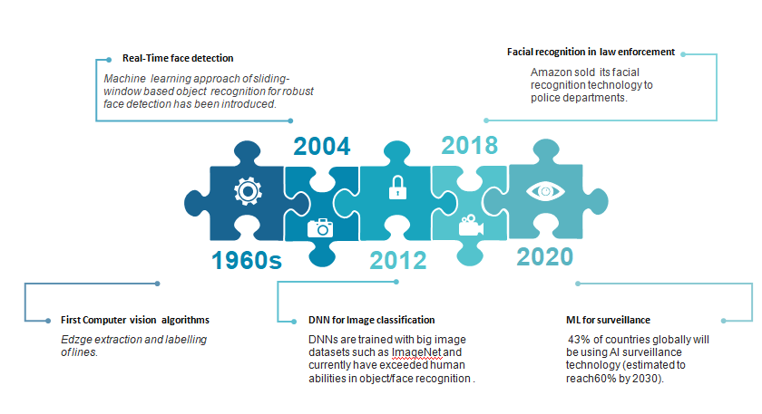

# Dependencies
- Python ( I used 3.8.2)
- opencv
- imutils
- stmplib 
- Flask

# AI-powered-surveillance-using-raspberry-pi
this projet aims to automate surveillance  using the Raspberry Pi computer and its camera module . This project was inspired by other older works and it's a push towards the AI-powered surveillance as computer vision and IoT are strongly emerging.
The main focuses of this project are efficiency and  accuracy .


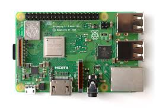

Here's the general Idea/architecture of the project :

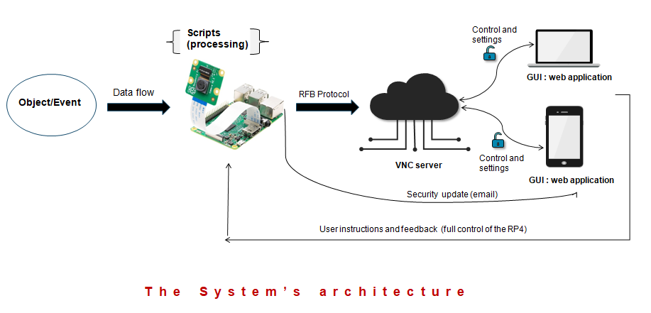

If we zoom in on the Raspberry Pi here's what's the script looks like :


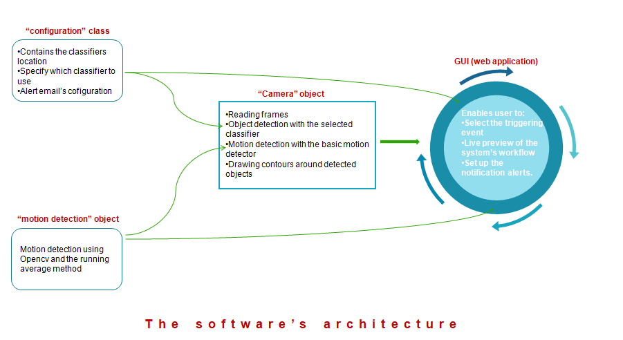

# Motion detection 
the motion detector is completely built using Opencv . It follows these basic steps (the last image is actually for contour and motion detection) :


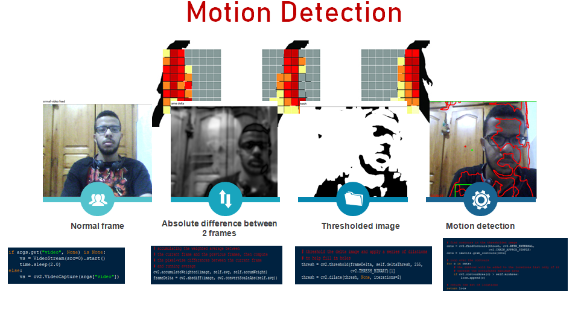

# Cascade Classifiers (for specific object detection)

To secifically detect objects I used cascade classification .
this classifiers will detect the object that will trigger the security camera .
Here's an overview concerning cascade classifiers : 

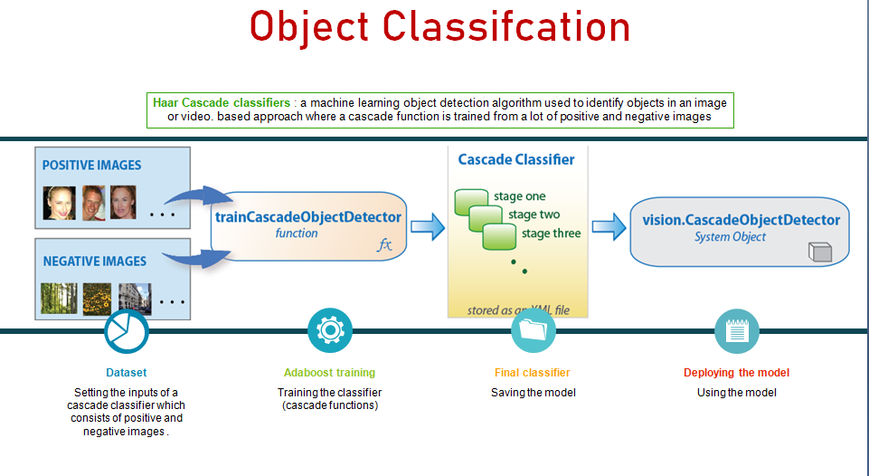

# The GUI ( Web-app)

The GUI that enables the user to intract with the camera and change the settings is developed using Flask :

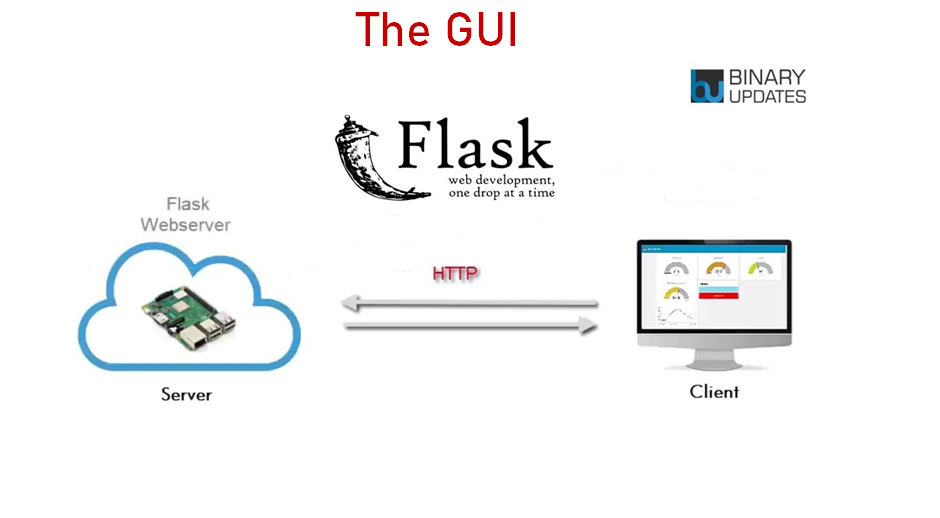
Here's how the GUI looks like with a live preview :

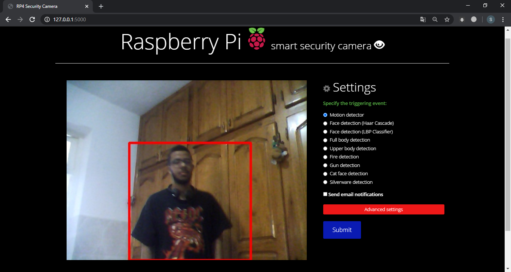

# The different options :

the user can specify one of many objects to trigger the security camera .Here are some examples : 
## face detection :
I used Haar cascade and LBP classifiers just to show the difference ( Haar cascade is more accurate but LBP is faster) : 


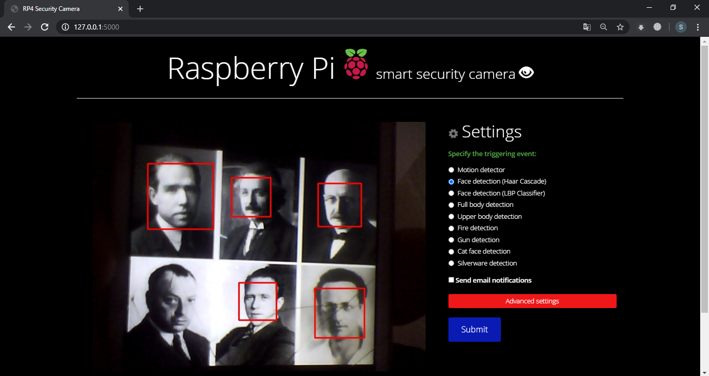

## gun detection : 


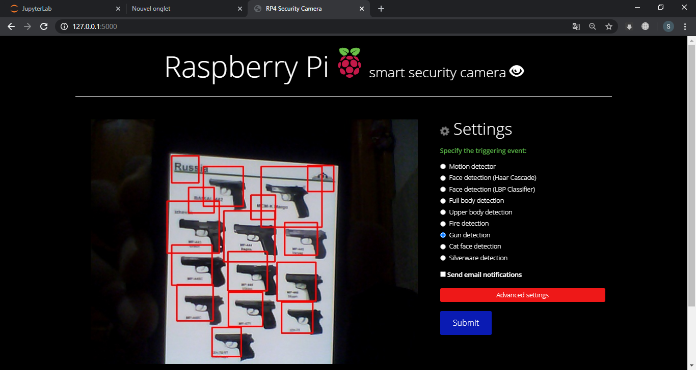

## fire detection : 


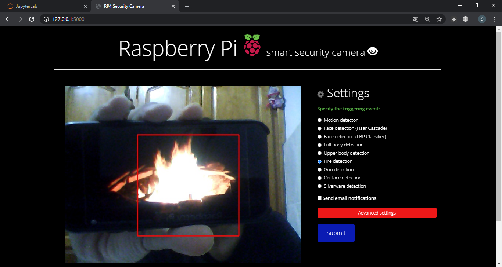

#### Note : to view the selected classifier at work in real-time ; press on "advanced settings" and check 
- [x] enable live preview with object detection
#### to expirement with cameras other than the raspberry pi's , just change the argument in "video_capture = cv2.VideoCapture()" to suit your needs ( the source of frames in this project is a usb camera , hence "video_capture = cv2.VideoCapture(src=0)" .
#### I also added the js darkmode file if you have a problem using the cdn link .
#### if you are accessing the Raspberry pi via ssh tunnel you have to use X forwading to be able to launch the GUI via your default browser.

## receiving the security alerts :

#### NOTE : make sure you "allow less secure apps to access gmail" for the account that you will use to send you alerts. it's in the gmail settings.

The GUI enables you to specify the sender and receiver adresses ( gmail only compatible as we are using smtp) : 

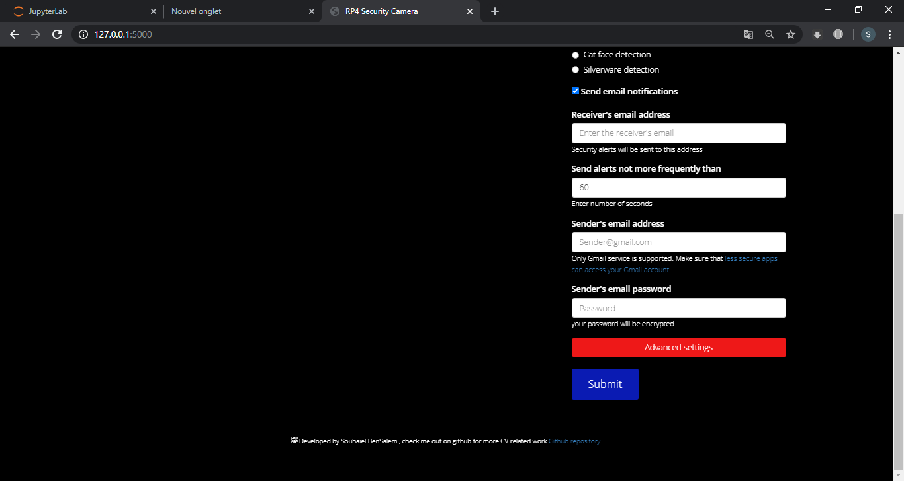

Here's how the security alert looks like :


# How to run the project :

First of all code is adapted to the use of a usb camera , so if you're using the pi's camera module you have to make some small changes . 
I used the Raspberry Pi 4 modeb B with 2GB of RAM .
To install OpenCV on the pi , please refer Adrian's tutorial (pyimagesearch.com)
To control the Raspberry pi remotely to change settings and whatnot , install the VNC server on the pi , download VNC Viewer app for your Android or IOS device and create an account . This will enable you be fully in control wherever you are ; 
When everything is set , all you have to do is type these commad to launch the web app : 
```
source ~/.profile
workon cv
python app.py
```

#### Please note that I am kind of a beginner , so there's always room for improvement . Also thanks to everyone who's previous works inspired this project .
#### I'm very excited for what's to come . Cheers brothers!


